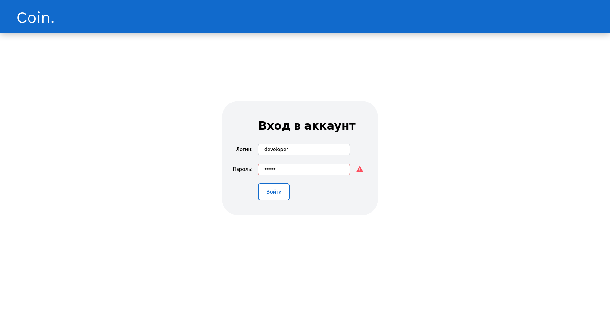
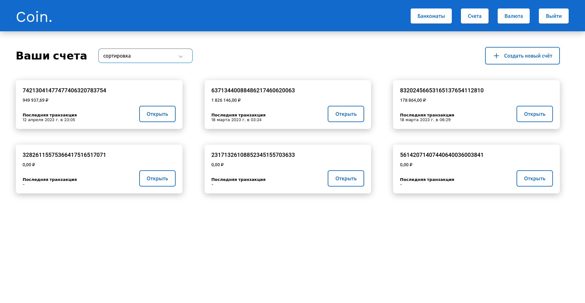
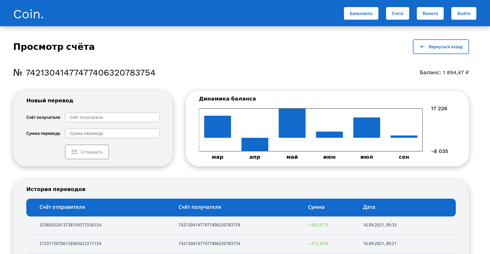
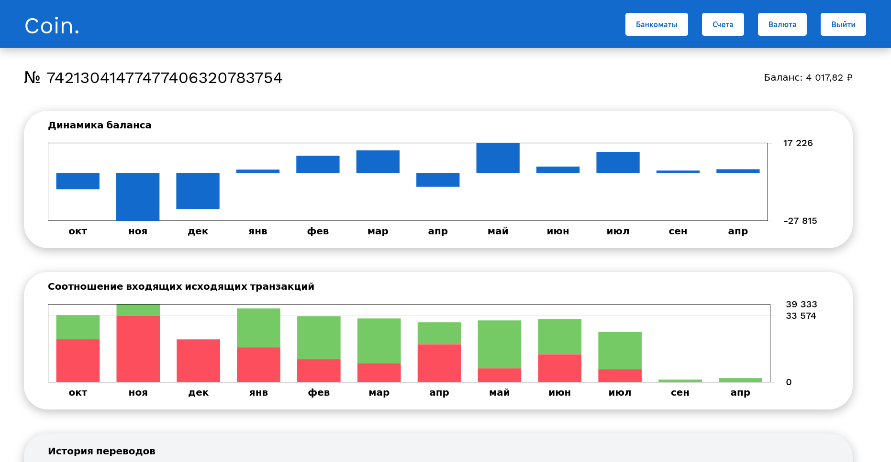
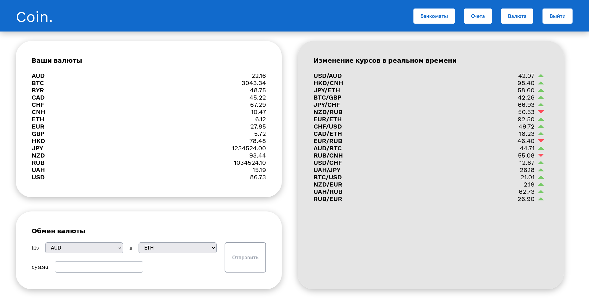
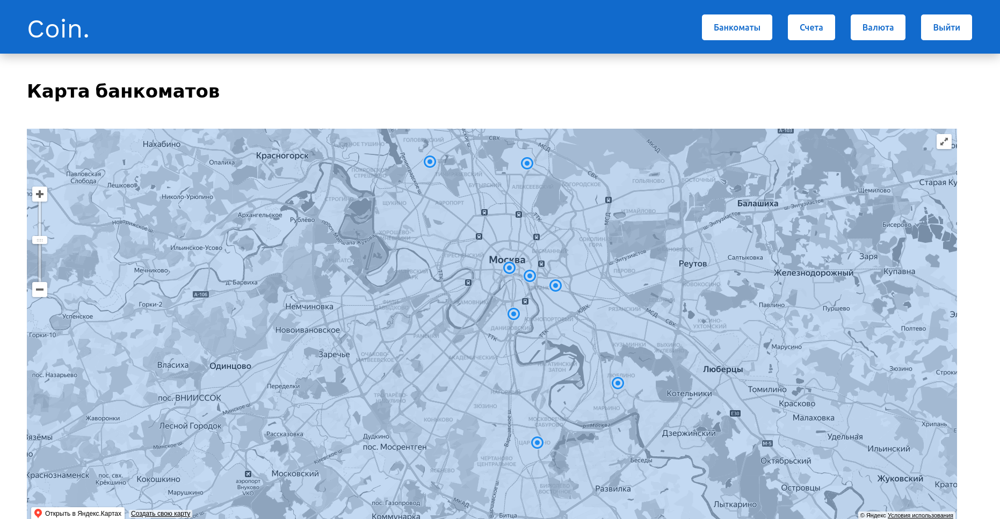

# Задание

Разработка банковской системы хранения и операций над криптовалютными средствами.
Задание касается только frontend-части системы.
Дизайн соответствует макету в [Figma](https://www.figma.com/file/JUJVDoP27x18v4Eqt66SdK/Bank-Diploma)

## Функционал приложения:

*   [x] **Авторизация**
*   [x] **Управление счетами пользователя:** создание нового счёта, отображение списка  счетов, отображение баланса, просмотр истории транзакций
*   [x] **Переводы на счета или карты других пользователей**
*   [x] **Возможность производить валютные обмены**
*   [x] **Отображение банкоматов на карте**

### Необходимо, чтобы веб-приложение имело следующие разделы:
*   [x] **Форма входа пользователя**
*   [x] **Список счетов пользователя**
*   [x] **Просмотр информации о существующей карте**
*   [x] **Форма для перевода средств**
*   [x] **Подробная история баланса по карте**
*   [x] **Мониторинг курса валют и валютные переводы**
*   [x] **Страница отображения точек банком тов на карте**

### Используемые инструменты
* [Prettier](https://prettier.io/)
* [ESLint](https://eslint.org/)
* [JSDoc](https://jsdoc.app/)
* [Charts.js](https://www.chartjs.org/)
* [Navigo](https://github.com/krasimir/navigo)
* [RE:DOM](https://redom.js.org/)
* [Webpack](https://webpack.js.org/)
### Установка и запуск

1.  Склонируйте репозиторий на свой компьютер, перейдите в папку `backend` и установите необходимые пакеты:
```shell
npm install
```

2.  Запуск сервера осуществляется командой:
```shell
npm start
```

3.  Затем перейдите в папку `mvp` и установите необходимые для его работы пакеты:
```shell
npm install
```
4. Запуск приложения на локальном сервере:
```shell
npm run dev
```
5. Сборка осуществляется коммандой:
```shell
npm run build
```

Регистрация новых пользователей не предусмотрена, для авторизации используется тестовая учётная запись:

логин: **developer**

пароль: **skillbox**
### Скриншоты






